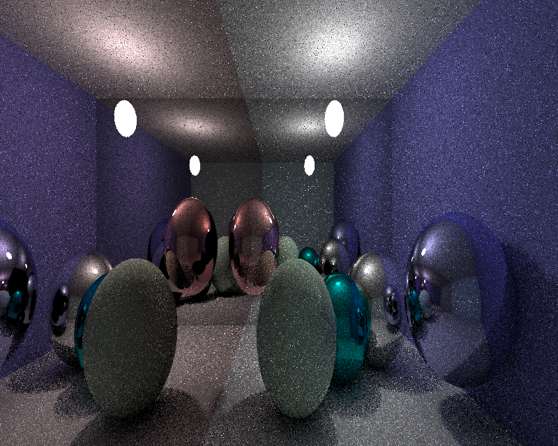

# B Group stochastic-ray-tracing

* 自己实现的向量类，预算过程未使用基本包外的包

  * 预算结果比较缓慢。如果需要得出比较好的图，大概要渲染2小时左右

  * 在**Release-Phote**文件夹中存有我们本地渲染的图片

  * 上传的程序大致需要渲染20分钟，主要是python跑图形学太慢了

* 图片演示(目标结果)
  * 
  * `以上是800x640分辨率，在两个采样点，最大深度为四的情况下的图。跑了20分钟在本地。`
