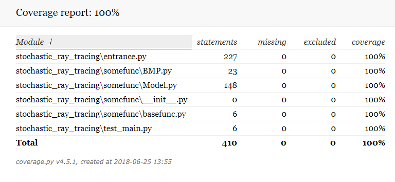

# B Group stochastic-ray-tracing

* 在**test_main.py**函数钟实现渲染
  * 直接运行pytest --cov-report=html --cov=stochastic_ray_tracing stochastic_ray_tracing\test_main.py
  * 如今分辨率是100x80,测试覆盖率使用
  * 如果想要渲染出图片能看，请在entrance.py中将**iResolution**修改为800x600，渲染时间为20分钟左右
  * 渲染的图片就在自身目录下，output.bmp

* 覆盖率截图

   

  

* 自己实现的向量类，预算过程未使用基本包外的包

  * 预算结果比较缓慢。如果需要得出比较好的图，大概要渲染2小时左右

  * 在**Release-Phote**文件夹中存有我们本地渲染的图片

  * 上传的程序大致需要渲染20分钟，主要是python跑图形学太慢了

* 图片演示(目标结果)
  * 
  * `以上是800x640分辨率，在两个采样点，最大深度为四的情况下的图。跑了20分钟在本地。`

其他一些效果图（渲染时间长）

